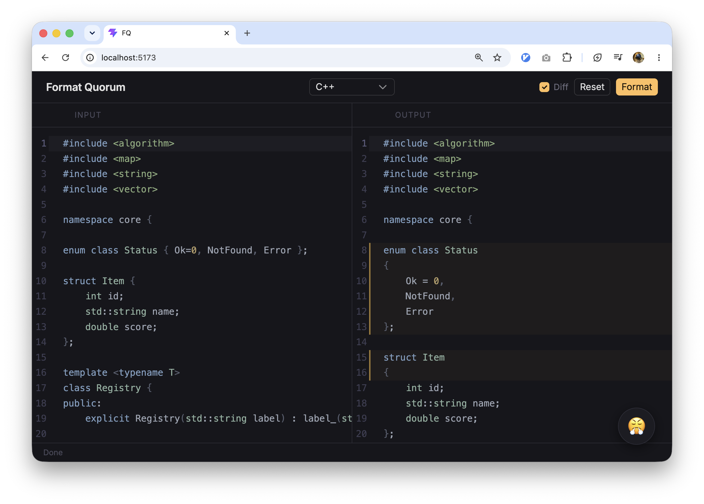

# format-quorum

A code-formatting playground and a test bench for a shared formatter config.
Paste code, hit **Format**, and see exactly what the formatter changed — changed
lines are highlighted. Then capture the cases you care about as **tests** and
watch, IDE-style, what the current config gets right and what it doesn't.



Supports **C++** via `clang-format` and **Python** via `ruff format`, each with
an opinionated house style.

---

## Running locally (one command)

The whole stack runs from a single container — no Node or clang-format needed on
the host:

```bash
docker compose up --build        # or: podman compose up --build
```

Then open `http://localhost:3000`.

> On a host without Docker you can use Podman: `podman compose up --build`.
> After a rebuild, recreate the container so the new image is served:
> `podman compose up -d --build --force-recreate`.

---

## Features

- **Playground** — format C++/Python and see a line-level diff of the changes.
- **clang-format versions** — pick the version to format with, or **Try add** an
  arbitrary `X.Y.Z`. The backend installs it (`pip install clang-format==X.Y.Z`)
  into an isolated venv; if there's no wheel for that version/platform it tells
  you. Installed versions persist across restarts.
- **Tests** — BEFORE → AFTER cases run against the current config:
  - green = pass, red = fail, **yellow = muted** (a conscious compromise / one to
    revisit later);
  - **Run all** with a summary (passed / failed / muted), or run a single case
    with its ▶ button; per-case panes show *Before / Desired / Actual* with the
    diff, plus an add-test form.
- **Edit the config in the browser** — the **Config** drawer edits
  `clang-format` / `ruff.toml` live. **Check impact** runs the whole suite
  against the edited config and the live one and reports what flips:
  `+N fixed · −N broken · N muted would pass`, so you see a change's blast radius
  before committing to it.
- **Drafts & Publish** — config and test edits first land in a **local draft**
  (browser `localStorage`), not on the shared server. A header bar shows the
  unsaved count with **Publish** (push the draft to the server) and **Discard**.
  This keeps concurrent users from clobbering each other on a shared instance —
  the server is the source of truth, everyone else stages locally until they
  publish.

A baseline suite seeded from ticket **LOGS-5799** and the config-review PR ships
in `backend/tests/`.

---

## Development

```bash
cd backend && python3 -m venv .venv && ./.venv/bin/pip install -r requirements.txt
cd ../app && npm install && npm run dev
```

`npm run dev` runs Vite (`http://localhost:5173`) and the FastAPI backend
(`uvicorn`, port `3001`) together; Vite proxies `/api`, `/clang-format` and
`/ruff.toml` to the backend.

---

## Stack

| | |
|---|---|
| Frontend | React 19, TypeScript, Vite |
| Editor | CodeMirror 6 via `@uiw/react-codemirror` |
| UI | Gravity UI |
| Backend | Python, FastAPI, uvicorn |
| C++ formatter | `clang-format` (pip, multi-version) |
| Python formatter | `ruff format` |

---

## Configuration

Formatter configs are the single source of truth in `backend/configs/`:

- `clang-format` — C++ style (anonymised house conventions)
- `ruff.toml` — Python style (line length 88, single quotes)

They're served at `/clang-format` and `/ruff.toml` (and via `GET /api/config/{lang}`),
so the UI always shows the config formatting actually uses. The **Config** drawer
edits them through `PUT /api/config/{lang}`.

### Versioned config — so a good config can't be lost

Config changes are **never a destructive overwrite**. Each published config is
appended to a per-language **version history** (`config_store.py`): the repo
config is version 0 (the *base*), and every `PUT` records a new version with its
diff (`patch`), author and message. The current config — what the formatter and
`GET /api/config/{lang}` use — is the latest version, *materialized* back into the
config file. `GET`/`PUT` look exactly as before; underneath, anyone can change the
config but nothing is irreversible:

- `GET /api/config/{lang}/history` — the full version list with patches.
- `POST /api/config/{lang}/rollback {seq}` — restore an earlier version (0 = base).
  Rollback is append-only — it's recorded as a new version, so it too can be undone.

### Persistence on a deployed instance

`docker-compose.prod.yml` keeps three things in named volumes so a deploy never
loses live state:

- **Config history** (`config_data`) — base + every published version. On start the
  current version is re-materialized from this volume over the git-backed config
  file, so the live config (and its rollback history) survives a deploy that resets
  the repo. The committed `backend/configs/` only seeds the *base* on a fresh volume.
- **Tests** (`tests_data`) — UI edits survive deploys; a fresh volume is seeded once
  from the image-baked snapshot (`backend/tests/` → `/app/tests-seed`).
- **clang-format versions** (`clang_versions`) — installed versions persist.

Locally, tests are JSON under `backend/tests/` and the base configs live in
`backend/configs/`, both version-controlled, so the baseline lives in the repo.

---

## API

The API is open (no auth) so it can be driven by scripts/agents. Every
format/run call also accepts an ad-hoc `config` string to format against a
candidate config **without** overwriting the stored one (used by the tuning
bench and the impact preview).

`/api/tests/whatif` is the dedicated *hypothesis* endpoint: give it a `patch`
(top-level clang-format key overrides applied on the live config, e.g.
`{"AlignAfterOpenBracket": "DontAlign"}`) or a whole `config`, and it runs the
suite twice — live vs candidate — and returns what flips (`now_pass`,
`now_fail`, `muted_would_pass`), plus the status of any named `targets`. So
"will this option fix test P7 / what does it break?" is one call.

| Method | Path | Purpose |
|--------|------|---------|
| POST | `/api/format` | format `{code, language, clang_version?, config?}` |
| GET/POST | `/api/clang-versions` | list / install a clang-format version |
| DELETE | `/api/clang-versions/{v}` | remove an installed version |
| GET/POST/PUT/DELETE | `/api/tests` … | manage tests |
| POST | `/api/tests/run` | run the suite (`{clang_version?, config?}`) |
| POST | `/api/tests/{id}/run` | run a single test |
| POST | `/api/tests/whatif` | hypothesis check: `{patch?, config?, targets?}` → which tests flip pass/fail |
| GET/PUT | `/api/config/{lang}` | get current / publish a new version of a config (`cpp` \| `python`) |
| GET | `/api/config/{lang}/history` | config version history (base + each change's patch) |
| GET | `/api/config/{lang}/history/{seq}` | full config content at a version (0 = base) |
| POST | `/api/config/{lang}/rollback` | roll the config back to version `{seq}` |
| GET | `/clang-format`, `/ruff.toml` | raw config files |

---

## Skills

`.claude/skills/` ships two agent skills that drive this instance over the API:

- **`format-quorum-api`** — manage tests and configs over HTTP (list / add /
  update / delete / run, get / put config).
- **`clang-format-tuning`** — a disciplined loop for solving a formatting
  problem: pin one clang-format version, pull the version-matched docs, sweep
  option combinations against a target test, and report the fix only if the
  target actually passes (with any regressions it causes). Its `cfprobe.py`
  works entirely through the `config`-override API.

---

## License

[MIT](LICENSE)
